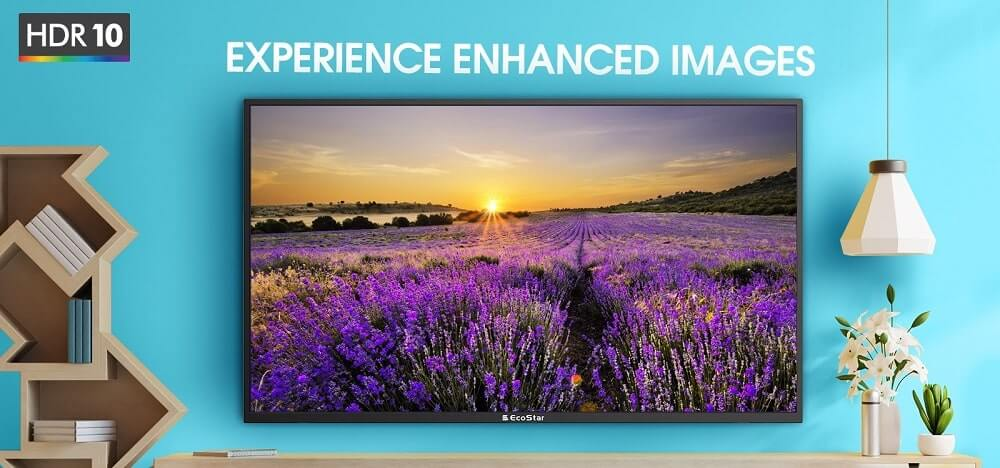

EcoStar has launched a new Android 11 LED TV with the latest operating system and software version. In terms of picture quality, you can choose from HD, FHD, or UHD 4K on an Android LED TV.

EcoStar's 11th-generation 4K Android LED TVs offer the best value in Pakistan among competing companies. And, despite an increasing smart TV price in Pakistan due to inflation. EcoStar is staying true to its promise of offering superior service in the most convenient methods for its clientele.

As an authorised online retailer, DWP Home is a go-to destination for purchasing Gree and EcoStar products. Improve your time with DWP Home by browsing the DWP Care section.

You may send complaints regarding any confusion relating to the products of Gree and EcoStar. For added convenience, there is also your complaint and service history for you to examine the record. When it comes to pre- and post-purchase support, DWP Home is unrivalled.

Additionally, the DWP Home app is available for download on the app stores for both Android and iOS. Download the DWP Home app on an Android device by clicking DWP Home - Apps on Google Play, or get it for an iOS device by clicking DWP Home in the App Store.

## 65-Inch LED Television by EcoStar

EcoStar is committed to making only the best Android LED TVs and expanding its product and service offerings in every way possible. There are a plethora of image and video processing engines built into Android 11 LED TVs, all of which work in tandem to provide a picture that is as close to natural as possible.

The audio technology is state-of-the-art as well as the visual ones. EcoStar Android LED TV has the lowest price in Pakistan for a smart LED TV despite its cutting-edge design and construction.

Along with HDR10, the 4k resolution and ultra HD display's frameless design create the illusion of infinite depth, giving you a viewing experience like no other.

To better enjoy your leisure time with a 65-inch LED TV, there is a world of entertainment at your fingertips with fully licenced Netflix, amazon prime, and YouTube. Furthermore, Bluetooth 5.1 allows for the simultaneous pairing of up to five devices.

For the low, low price of PKR 139,900, you may own this fantastic EcoStar Android LED TV. If you want more information, you can always check out the website.

## EcoStar 55-inch LED Television

The 55-inch LED TV is the next largest in EcoStar's lineup of Android LED TVs, following the 65-inch model. The EcoStar 55-inch Android LED TV costs 95,900 PKR in Pakistan.

In addition, features like Chromecast make it possible to see your favourite content from your mobile device on a larger display.

To share your media with the whole family, just cast it to the TV. The Google assistant also introduces a whole new level of practicality. By speaking into the remote control, you may have your TV play the content you want and carry out the actions you specify.

With its quad-core processing and superior picture and sound quality, your new EcoStar Android 11 LED TV will make you feel like a pro gamer.

## 50-Inch EcoStar Smart LED TV

The Google Play Store is available for unlimited app downloads on an EcoStar 50-inch smart TV. EcoStar 50-inch LED TV comes with 2 GB RAM and 8 GB ROM with the finest HD video quality.

Also, you may experience superb sound quality with DTS TruSurround sound with an outstanding initial pricing of 50-inch LED price in Pakistan i.e. 83,900 PKR.

The EcoStar Android LED TV has not just cutting-edge software but also a gorgeous, minimalist body design. The sophisticated design improves the overall aesthetic of your home.

Introducing the EcoStar Android LED TV, Pakistan's Best LED TV.

EcoStar's new Android LED TVs are reasonably priced, so the company's consumers won't have to worry about the high cost of smart TVs. EcoStar Android LED TV includes all the functions that matter.

The greatest LED TV in Pakistan, without a doubt. There are also 32-inch, 39-inch, 40-inch, 43-inch, and 75-inch Android LED TVs available.

All of the smart TVs on the market today have top-tier technology and software. In addition, EcoStar has the best Android LED TV handling and short delivery times in the industry.

### Conclusion

With prices ranging from around PKR 30,000 to PKR 140,000, EcoStar has the greatest Android LED TV deals in Pakistan. We have the right to make adjustments to these pricing at any moment.